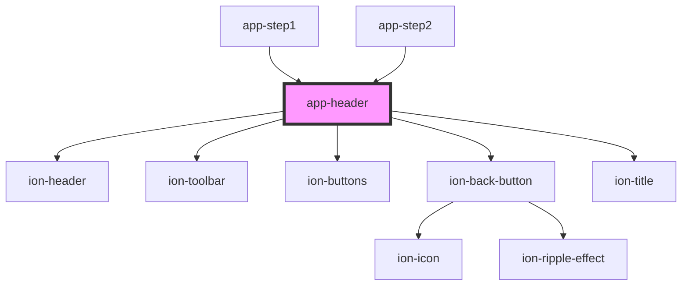

# app-header

<!-- Auto Generated Below -->

## Properties

| Property     | Attribute     | Description | Type      | Default     |
| ------------ | ------------- | ----------- | --------- | ----------- |
| `backButtom` | `back-buttom` |             | `boolean` | `undefined` |
| `ionTitle`   | `ion-title`   |             | `string`  | `undefined` |

## Dependencies

### Used by

 - [app-step1](../app-step1)
 - [app-step2](../app-step2)

### Depends on

- ion-header
- ion-toolbar
- ion-buttons
- ion-back-button
- ion-title

### Graph

----------------------------------------------

*Built with [StencilJS](https://stenciljs.com/)*
