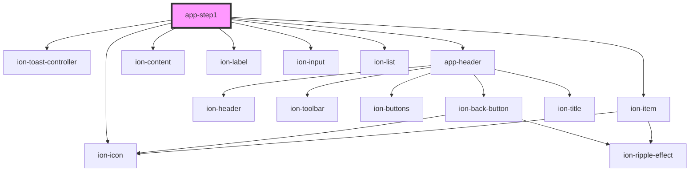

# app-step1

<!-- Auto Generated Below -->

## Properties

| Property     | Attribute     | Description | Type     | Default     |
| ------------ | ------------- | ----------- | -------- | ----------- |
| `backUrl`    | `back-url`    |             | `string` | `undefined` |
| `clientId`   | `client-id`   |             | `string` | `undefined` |
| `clientName` | `client-name` |             | `string` | `undefined` |

## Dependencies

### Depends on

- ion-toast-controller
- [app-header](../app-header)
- ion-content
- ion-item
- ion-label
- ion-input
- ion-list
- ion-icon

### Graph

----------------------------------------------

*Built with [StencilJS](https://stenciljs.com/)*
