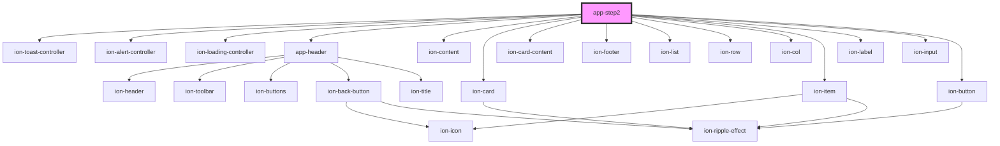

# app-step2

<!-- Auto Generated Below -->

## Properties

| Property         | Attribute         | Description | Type     | Default     |
| ---------------- | ----------------- | ----------- | -------- | ----------- |
| `backUrl`        | `back-url`        |             | `string` | `undefined` |
| `clientId`       | `client-id`       |             | `string` | `undefined` |
| `selectedOption` | `selected-option` |             | `any`    | `undefined` |

## Dependencies

### Depends on

- ion-toast-controller
- ion-alert-controller
- ion-loading-controller
- [app-header](../app-header)
- ion-content
- ion-card
- ion-card-content
- ion-footer
- ion-list
- ion-row
- ion-col
- ion-item
- ion-label
- ion-input
- ion-button

### Graph

----------------------------------------------

*Built with [StencilJS](https://stenciljs.com/)*
