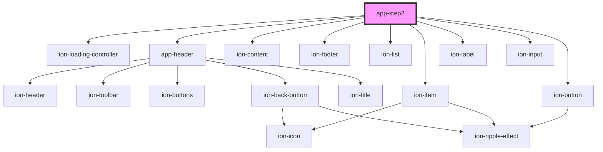

# app-step2

<!-- Auto Generated Below -->

## Properties

| Property          | Attribute         | Description | Type  | Default     |
| ----------------- | ----------------- | ----------- | ----- | ----------- |
| `selected_option` | `selected_option` |             | `any` | `undefined` |

## Dependencies

### Depends on

- ion-loading-controller
- [app-header](../app-header)
- ion-content
- ion-footer
- ion-list
- ion-item
- ion-label
- ion-input
- ion-button

### Graph

----------------------------------------------

*Built with [StencilJS](https://stenciljs.com/)*
