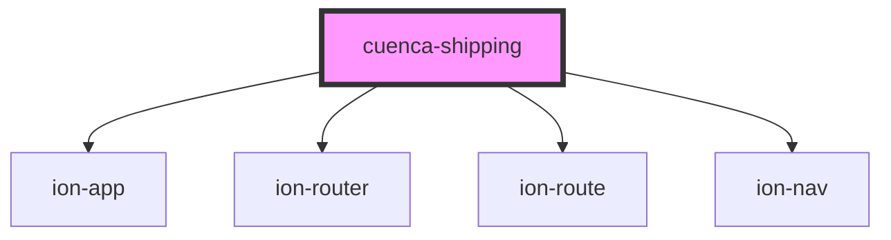

# my-component

<!-- Auto Generated Below -->

## Properties

| Property     | Attribute     | Description | Type     | Default     |
| ------------ | ------------- | ----------- | -------- | ----------- |
| `apiKey`     | `api-key`     |             | `string` | `undefined` |
| `backUrl`    | `back-url`    |             | `string` | `undefined` |
| `clientId`   | `client-id`   |             | `string` | `undefined` |
| `clientName` | `client-name` |             | `string` | `undefined` |

## Dependencies

### Depends on

- ion-app
- ion-router
- ion-route
- ion-nav

### Graph

----------------------------------------------

*Built with [StencilJS](https://stenciljs.com/)*
