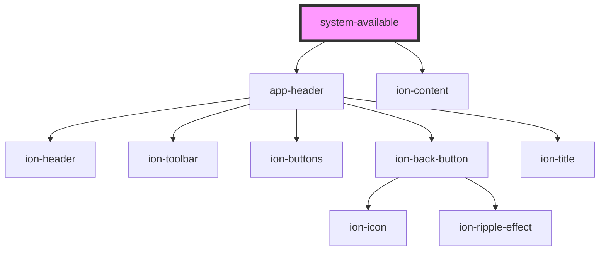

# system-available

<!-- Auto Generated Below -->

## Dependencies

### Depends on

- [app-header](../app-header)
- ion-content

### Graph

----------------------------------------------

*Built with [StencilJS](https://stenciljs.com/)*
